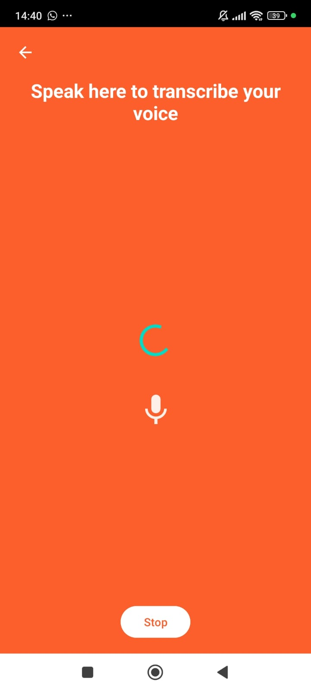
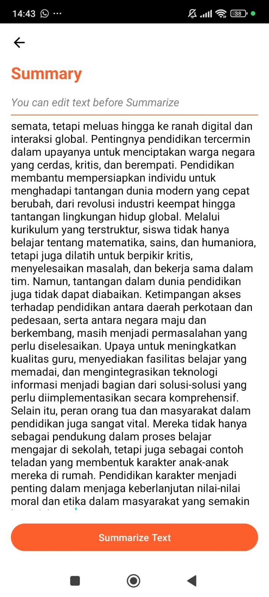
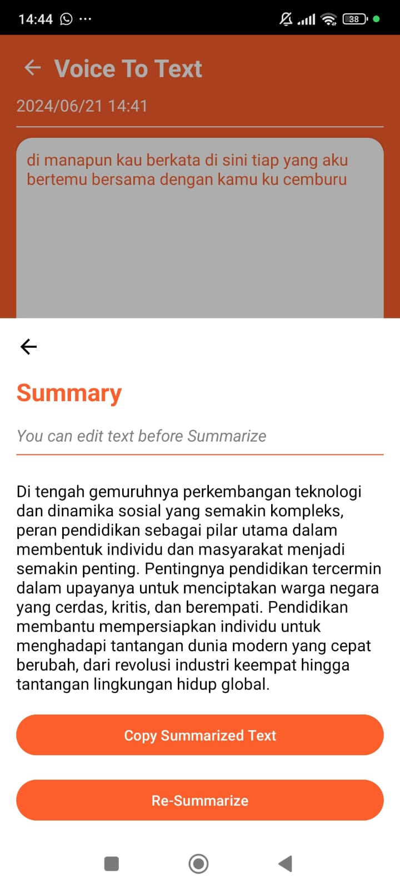
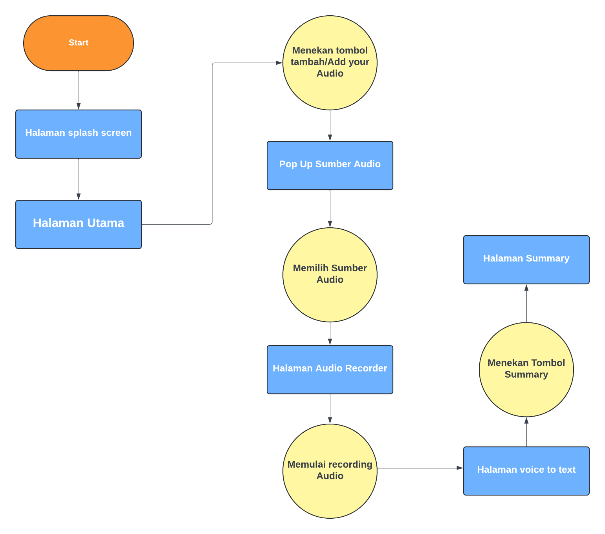

# C241-PS042-Capstone-Yap2Type

Organisasi ini adalah bagian dari Bangkit 2024 Product Capstone.

## About

Yap2Type adalah alat mutakhir yang dibuat untuk membantu pengguna merangkum konten berbasis audio seperti berita, podcast, konferensi, dan percakapan. Pengguna dapat merekam atau mengunggah file audio ke aplikasi, dan kecerdasan buatan digunakan untuk merangkum konten menjadi poin-poin penting yang jelas dan singkat. Pengguna dapat menghemat waktu dan usaha dengan menggunakan Yap2Type untuk dengan cepat mendapatkan gambaran dari percakapan atau diskusi tanpa harus mendengarkan rekaman lengkap lagi.

## Team Members

| Nama                   | ID Mahasiswa Bangkit | Role                |
|------------------------|----------------------|---------------------|
| Muhammad Irfan         | M132D4KY1867         | Machine Learning    |
| Akhmad Fadilla Akbar   | M119D4KY1765         | Machine Learning    |
| Farig Muhammad Taqy    | M132D4KY2015         | Machine Learning    |
| Arifin Mulqa Maulana   | C152D4KY0991         | Cloud Computing     |
| Puput Unggul Prayoga   | C152D4KY0148         | Cloud Computing     |
| Rahman Faisal          | A132D4KY4559         | Mobile Development  |
| Nabilla Zhavirah       | A573D4KX4374         | Mobile Development  |

## Mobile Development Documentation

### Features

There 3 main feature for now, among them :

1. Recording Video



2. Voice to Text


3. Summarize Text





### Technical Details

This mobile application was created starting with UI/UX design then implementing the design results using native Android Kotlin by utilizing supporting libraries such as Retrofit to interact with the API. This app has voice recorder, voice to text, and summary. Users can record sound from their device which will be converted into text and Users can summarize the text.



Flow Android

## Machine Learning Documentation

### Yap2Type Machine Learning Platform

This repository contains the implementation of a cutting-edge tool designed to assist users in summarizing audio-based content, such as news, podcasts, conferences, and conversations. Yap2Type leverages advanced artificial intelligence techniques to distill audio content into clear, concise bullet points, helping users quickly obtain an overview without having to listen to the full recording again. This tool can be particularly beneficial for students, journalists, business professionals, and anyone who needs a rapid way to absorb the main ideas from lengthy discussions.

## Yap2Type Audio Summarization Models

### Yap2Type Voice Recognition

The Yap2Type voice recognition model employs state-of-the-art deep learning techniques to accurately transcribe audio recordings into text. By utilizing transfer learning from pre-trained models on the HuggingFace platform, this component ensures high accuracy and efficiency in recognizing various speech patterns, accents, and audio qualities. The transcription forms the foundation for subsequent summarization processes.

### Yap2Type Summary

The Yap2Type summary model is designed to generate concise and relevant summaries from transcribed audio text. Using advanced natural language processing (NLP) techniques, this model identifies key points and essential information, transforming lengthy text into clear and actionable bullet points. The summary level is adjustable, allowing users to customize the depth and detail of the summaries according to their needs.

### Yap2Type Tokenizer

The Yap2Type tokenizer component is responsible for preprocessing the transcribed text, breaking it down into manageable units for efficient processing by the summarization model. By tokenizing the text, the system can better understand the context and structure of the content, enhancing the overall accuracy and coherence of the generated summaries.

### Yap2Type Transfer Learning from HuggingFace

The Yap2Type platform leverages transfer learning from pre-trained models available on HuggingFace, a popular repository for NLP models. By fine-tuning these models on our custom dataset, which includes diverse audio recordings of news, podcasts, conferences, and conversations, Yap2Type ensures high performance and adaptability to various audio sources. This approach significantly reduces training time and computational resources while maintaining high accuracy and relevance in summaries.


## Cloud Computing Documentation

### Step by Step Deployment

1. **Clone the GitHub Repository**

   Clone the Yap2Type repository to your local machine using the following command:

   A. Clone Repositori Utama

   ```bash
      git clone https://github.com/rahmanfaisal0414/C241-PS042-Capstone-Yap2Type.git
   ```
   
   B. Move to Subdirectory, After cloning the main repository, move to the subdirectory you want:

   ```bash
   cd C241-PS042-Capstone-Yap2Type/cc
   ```

2. **Download `tf_model.h5` In Drive**
   Download the `tf_model.h5` file from the provided Google Drive link or any other source where it's hosted.

   ```bash
   https://drive.google.com/drive/folders/1JJXHK9qaq_EVuX9VGWGQt1v4a5VtBJQj?usp=sharing

3. **Save tf_model.h5 to directory model**
   Save the downloaded tf_model.h5 file into the model directory within the cloned repository. 

4. **Install Required Libraries**
   You can follow the docker, requirements , dockerignore file libraries that we use

## API Speech to Text

In Yap2Type, the speech-to-text functionality is powered by a cloud computing service. Here is a step-by-step explanation of how the integration is achieved:

1. **Service Account Creation**:
   - First, a service account is created with the necessary permissions. The role chosen for the service account is `Service Account Admin`. This role allows managing and configuring the service account which will be used to authenticate and authorize API requests.

2. **Enable Speech-to-Text API**:
   - After creating the service account, the Speech-to-Text API is enabled. This involves going to the API services in the cloud platform and enabling the Speech-to-Text API.

3. **Authentication and API Usage**:
   - With the service account and the API enabled, an authentication token is generated which is used to authenticate API requests. The application then sends audio files to the API, which processes them and returns the transcribed text.

By leveraging cloud computing, Yap2Type can efficiently handle speech-to-text conversion, providing accurate and fast transcription services without requiring extensive local processing power.

## Deployment Requirements

Below is the `requirements.txt` file listing the necessary Python packages for Yap2Type:

```plaintext
Flask==3.0.3
flask-cors==4.0.1
tensorflow==2.16.1
tf-keras==2.16.0
transformers==4.41.2
Werkzeug==3.0.3
blinker==1.8.2
```

## Docker Configuration

### Docker Ignore File

Below is the `.dockerignore` file to exclude unnecessary files from the Docker build context:

```plaintext
__pycache__
*.pyc
*.pyo
*.pyd
.Python
env
build
dist
*.egg-info
```

### DOCKERFILE

```plaintext
FROM python:3.9-slim

WORKDIR /app

COPY requirements.txt .
RUN pip install sentencepiece \
    && pip install --no-cache-dir -r requirements.txt

COPY . .

EXPOSE 8080

ENV PORT 8080

CMD ["python", "main.py"]
```


## Dataset Citation
========

@inproceedings{kurniawan2018,
  place={Bandung, Indonesia},
  title={IndoSum: A New Benchmark Dataset for Indonesian Text Summarization},
  url={https://ieeexplore.ieee.org/document/8629109},
  DOI={10.1109/IALP.2018.8629109},
  booktitle={2018 International Conference on Asian Language Processing (IALP)},
  publisher={IEEE},
  author={Kurniawan, Kemal and Louvan, Samuel},
  year={2018},
  month={Nov},
  pages={215-220}
}
